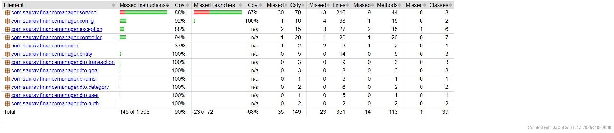

# Personal Finance Manager

A Spring Boot based REST API application for managing personal finances, including income tracking, expense management, savings goals, and financial reports.

## Features

* User Registration and Login
* Session-Based Authentication
* Income and Expense Tracking
* Default and Custom Categories
* Savings Goal Management
* Monthly and Yearly Financial Reports
* Input Validation and Exception Handling
* PostgreSQL Database Integration
* RESTful API Design
* Unit and Integration Testing

---

# Tech Stack

* Java 21
* Spring Boot 3
* Spring Security
* Spring Data JPA (Hibernate)
* PostgreSQL
* Maven
* Lombok
* JUnit 5
* Mockito

---

# Project Architecture

The project follows layered architecture:

```text
Controller
   ↓
Service
   ↓
Repository
   ↓
Database
```

Additional components:

* DTO-based request/response handling
* Global exception handling using `@ControllerAdvice`
* Session-based authentication using secure cookies

---

# API Modules

## Authentication

* Register User
* Login
* Logout

## Categories

* View Default Categories
* Create Custom Categories
* Delete Custom Categories

## Transactions

* Create Transactions
* Update Transactions
* Delete Transactions
* Filter Transactions

## Savings Goals

* Create Goal
* Update Goal
* Delete Goal
* Track Progress

## Reports

* Monthly Financial Reports
* Yearly Financial Reports

---

# Database

PostgreSQL is used as the primary database.

The application supports:

* Local PostgreSQL setup
* Cloud PostgreSQL deployment on Render

---

# Environment Variables

The application supports environment-based configuration.

| Variable                   | Description                       |
| -------------------------- | --------------------------------- |
| SPRING_DATASOURCE_URL      | PostgreSQL JDBC URL               |
| SPRING_DATASOURCE_USERNAME | Database username                 |
| SPRING_DATASOURCE_PASSWORD | Database password                 |
| PORT                       | Server port                       |
| SHOW_SQL                   | Enable/disable Hibernate SQL logs |

---

# application.properties

```properties
spring.application.name=financemanager

spring.datasource.url=${SPRING_DATASOURCE_URL:jdbc:postgresql://localhost:5432/finance_manager}
spring.datasource.username=${SPRING_DATASOURCE_USERNAME:postgres}
spring.datasource.password=${SPRING_DATASOURCE_PASSWORD:postgres}

spring.jpa.hibernate.ddl-auto=update
spring.jpa.show-sql=${SHOW_SQL:false}
spring.jpa.properties.hibernate.format_sql=true
spring.jpa.open-in-view=false

server.port=${PORT:8080}
```

---

# Running the Project Locally

## Clone Repository

```bash
git clone <your-repository-url>
cd financemanager
```

## Run Application

Using Maven Wrapper:

### Linux / Mac

```bash
./mvnw spring-boot:run
```

### Windows

```bash
mvnw.cmd spring-boot:run
```

---

# Build Project

```bash
mvn clean install
```

---

# API Base URL

```text
http://localhost:8080/api
```

---

# Authentication

The application uses session-based authentication.

After successful login:

* Server generates a session
* Session cookie (`JSESSIONID`) is used for authenticated requests

No JWT authentication is used.

---

# Validation and Error Handling

The application includes:

* Request validation
* Proper HTTP status codes
* Global exception handling

Common status codes:

| Code | Meaning          |
| ---- | ---------------- |
| 200  | Success          |
| 201  | Resource Created |
| 400  | Bad Request      |
| 401  | Unauthorized     |
| 403  | Forbidden        |
| 404  | Not Found        |
| 409  | Conflict         |

---

# Testing

Run tests using:

```bash
mvn test
```

The project includes:

* Unit Tests
* Integration Tests

---

## Test Coverage

The project includes:

* Unit Tests
* Integration Tests
* API Validation Tests

JaCoCo was used to measure code coverage.

### Coverage Summary

* Instruction Coverage: **90%**
* Branch Coverage: **68%**



---

# Deployment

The application is deployable on:

* Render
* Railway
* Any Spring Boot compatible hosting platform

---

# Author

Saurav Sagar

* GitHub: https://github.com/Hacker-maverick
* LinkedIn: https://www.linkedin.com/in/saurav-sagar-25a286290
